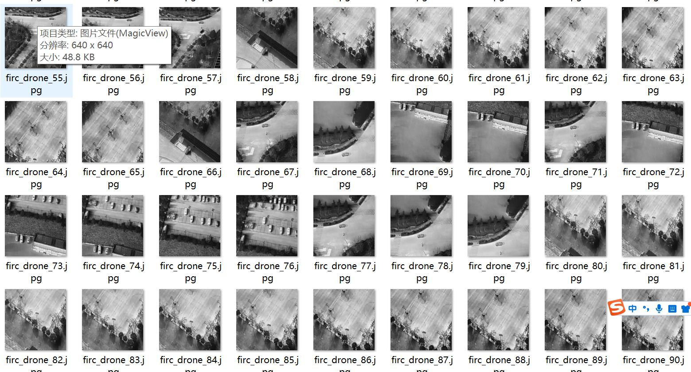
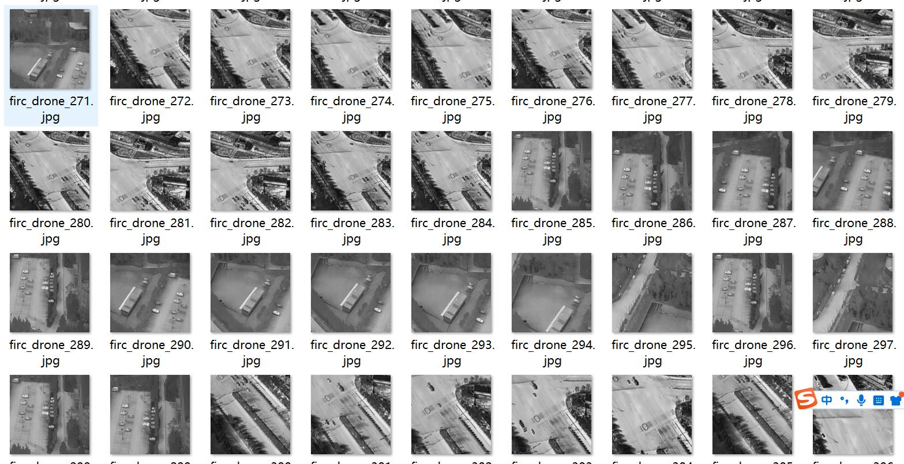
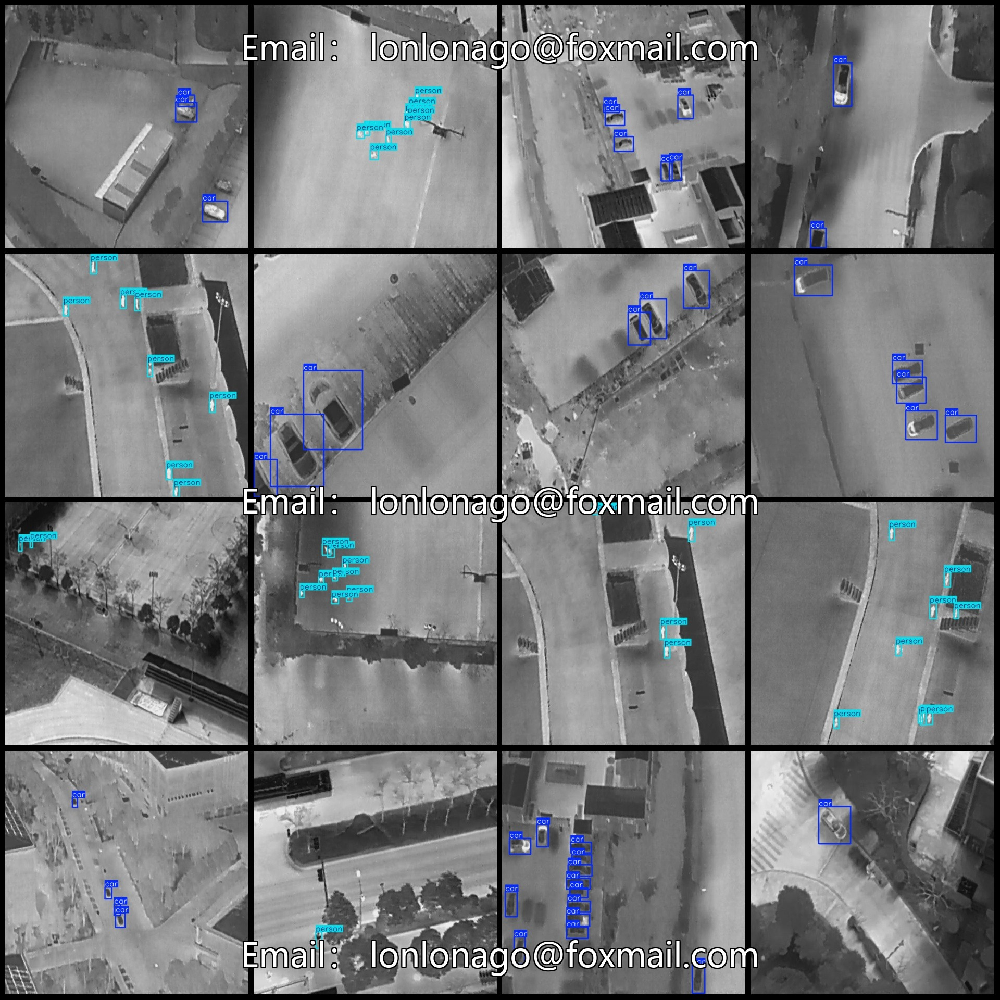
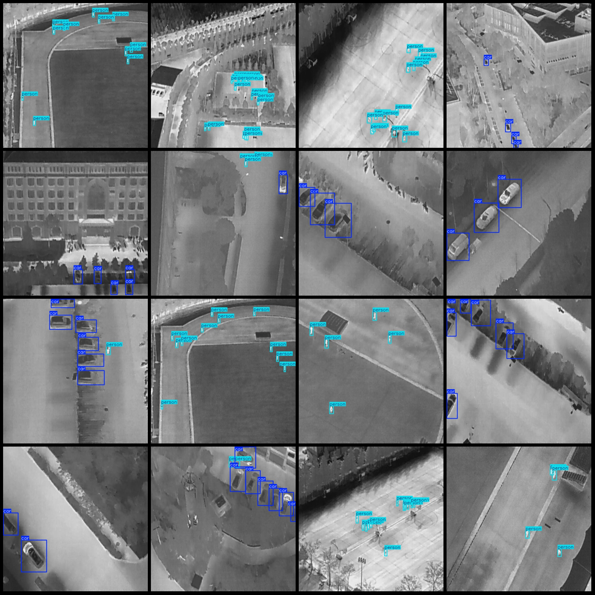

# Drone Perspective Thermal Infrared Pedestrian and Vehicle Detection Dataset VOC+YOLO format with 2755 images in 2 categories

Dataset format: Pascal VOC format + YOLO format (excluding segmentation path in .txt files, only containing jpg images along with their corresponding VOC format xml files and YOLO format txt files)
Image count (number of jpg files): 2755
Annotation count (number of xml files): 2755
Annotation count (number of txt files): 2755
Number of annotation categories: 2
Annotation category names (note that the order of categories in the YOLO format does not correspond to this, but is based on the labels folder's classes.txt): ["car", "person"]
Number of bounding boxes per category:
car bounding boxes = 7311
person bounding boxes = 12312
Total bounding boxes: 19623
Number of bounding boxes per image:
car bounding boxes = 1398
person bounding boxes = 1691
Image resolution: 640x640
Annotation tool used: labelImg
Annotation rules: draw a bounding box around the category
Important note: The dataset does not include any split into training, validation, or test sets; you need to manually divide them.
Special declaration: This dataset does not guarantee the accuracy of the trained models or weight files.
Image preview:
Annotation example:

## Images

Here is a pay link on Stripe ( https://buy.stripe.com/3cs8yP7sY87d0vu9AB ). Please contact me lonlonago@foxmail.com after funding $89, and I will send you a complete data files , thank you!

